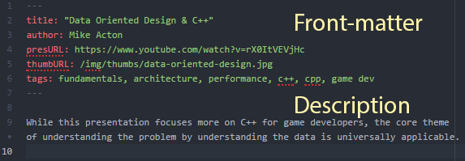
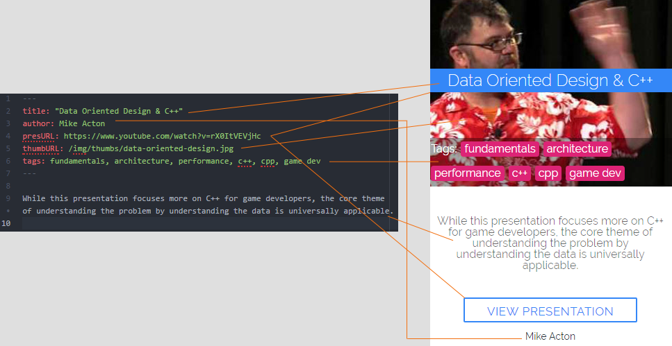

# How to Contribute

Adpres is meant to be a resource open to everyone, and as such, your contributions are not only welcome, but directly appreciated.  We encourage anyone to add to this list of curated presentations, because the point is in sharing great ideas.

## Getting Started

* You will need an account on [Github.com](https://github.com/) (any account will work).
* A Node.js installation is **not required** for contributing, but is very useful for testing your contributions.
* You'll need a publicly accessible link to the presentations you want to add, as well as a thumbnail, the presenter / author's name, and a short description of the presentation.
* Some exposure to [Metalsmith](http://www.metalsmith.io/), [Docpad](https://docpad.org/), [Jekyll](https://jekyllrb.com/), or similar static-site-generators is helpful, but not required.

## Making Changes

1. Start by forking the adpres repository
  * This creates a stand-alone copy of the repository under your control.  You can make changes here without impacting other people's work.
2. Make your changes in and commit them to your copy of the repository.
3. Issue a Pull Request from your repository targeting the adpres repository **master branch**.

## How to Add a Presentations

* **DO NOT** edit files in `public/`.  These are generated files, and your changes will be lost to overwriting.

To add a presentation, simply create a new file in `src/_presentations`.  This file should be named something relevant to the title of the presentation you are adding.  A slug-ified version of the presentation's title is usually perfectly acceptable.

Next you will need to add the data for the presentation you are adding.  Since these data is stored as pages that are instead digested into lists, it **is important** to follow the format here.

These files are divided into two sections: Front-matter, and the description.  The front-matter is used as data and meta-data for the list-item itself, while the description is displayed attached to the list-item.

> **Please Note** - While you can use an absolute URL for the thumbnail image, it may be necessary to create and host the image yourself.  This is especially true if the thumbnail image is located at an unreliable source or was generated as a purely temporary file.

> In this event, please add the thumbnail image to `src/img/thumbs`, and reference it the same as the above example.  This make it deployable on the adpres static site.

## Testing Your Changes

* To test your changes, you will need [Node.js](https://nodejs.org) installed in your environment.
* Begin by making sure the project dependancies are up to date.  To do this run `npm install` inside the project root directory.
* Now you can generate the static files that would appear on the ghpages for this project:
  * To generate a single time, use `npm run build`.  This builds the project files in development mode, once, then exits.
  * To generate the project files as they change, us `npm run live`.  this continually watches the files in `src/` and rebuilds the project in development mode as those files change.
* Open `public/index.html` in a browser of your choice and observe your changes.
